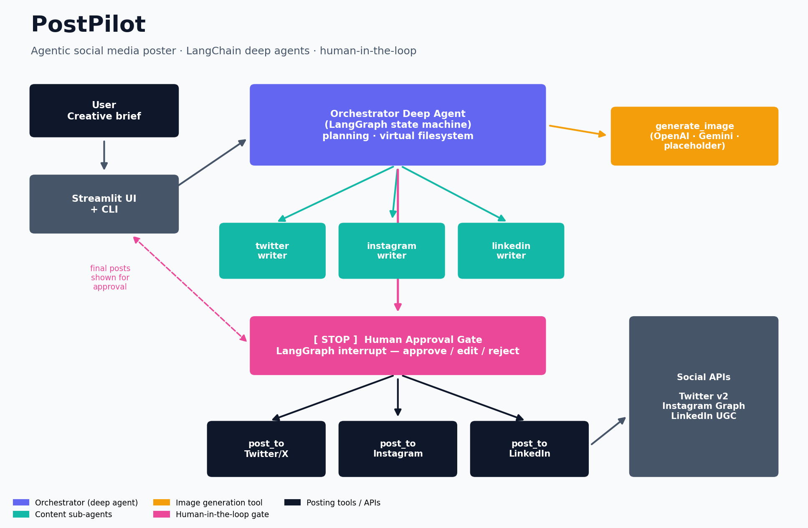
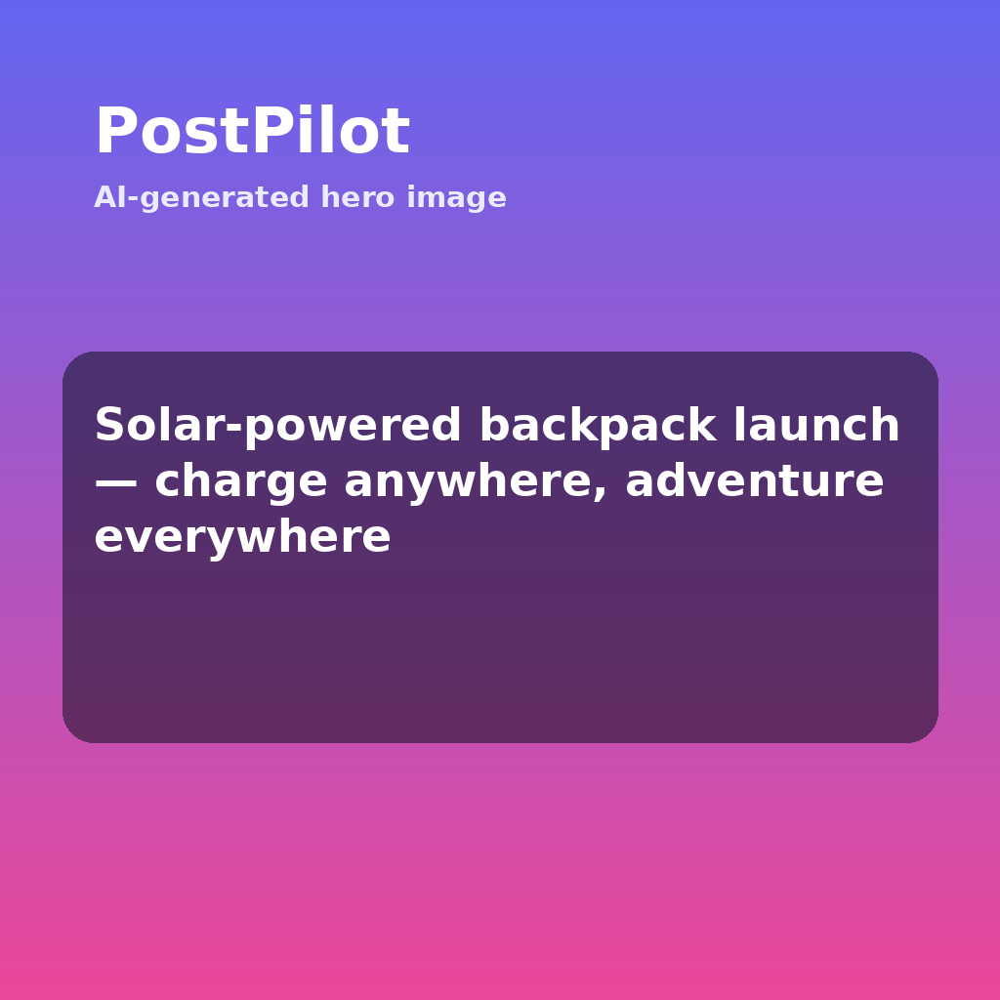

# 🚀 PostPilot — Agentic Social Media Poster

PostPilot turns a **single creative brief** into ready-to-publish posts for
**Twitter/X, Instagram, and LinkedIn** — generating a hero image, drafting
platform-native copy with specialist sub-agents, and showing you the **final
posts for approval** before anything goes live. Approve, and the agentic flow
publishes for you.

Built on **[LangChain `deepagents`](https://github.com/langchain-ai/deepagents)**
(planning + virtual filesystem + sub-agents on top of LangGraph) with a true
**human-in-the-loop approval gate** powered by LangGraph interrupts.



---

## ✨ What it does

```
Brief ─▶ Plan ─▶ Generate hero image ─▶ Draft per-platform copy (sub-agents)
      ─▶ ⛔ Show final posts for approval ─▶ Publish to each network
```

- **One brief in, a full campaign out.** You describe the post once.
- **Specialist sub-agents** write native copy per platform (tone, length,
  hashtag conventions) — Twitter ≤280, Instagram ≤2200, LinkedIn ≤3000 chars.
- **Hero image generation** via OpenAI or Gemini, with a zero-credential local
  placeholder fallback so the demo always runs.
- **Human-in-the-loop gate.** The agent *pauses* and surfaces the exact final
  payload (caption + image). You **approve / edit / reject** each post.
- **Agentic publishing.** Approved posts are published through the real
  platform APIs (or staged to `./outbox` in dry-run).

### The final-post approval screen

This is the only thing you have to look at — the finished posts, side by side:

| Hero image | Review & approve |
| --- | --- |
|  | Each platform card shows the image, the final caption with a live character count, and an **Approve / Edit / Reject** control. Nothing publishes until you press **Publish**. |

---

## 🏗️ Architecture

| Layer | Component | Role |
| --- | --- | --- |
| **UI** | `app.py` (Streamlit) / `cli.py` | Collect the brief, render final posts, capture approvals |
| **Orchestrator** | `src/social_poster/agent.py` | `deepagents` deep agent — plans, calls the image tool, delegates to sub-agents, requests publishing |
| **Sub-agents** | `twitter_writer`, `instagram_writer`, `linkedin_writer` | Isolated-context copywriters, one per platform |
| **Tools** | `src/social_poster/tools/` | `generate_image` + `post_to_{twitter,instagram,linkedin}` |
| **Approval gate** | `interrupt_on=` + LangGraph checkpointer | Pauses before every publish for approve/edit/reject |
| **Runner** | `src/social_poster/runner.py` | Start the flow, read pending posts, resume with decisions |

The three `post_to_*` tools are registered in `interrupt_on`, which wires
deepagents' Human-in-the-Loop middleware. Combined with a checkpointer, the
graph pauses before publishing and the UI resumes it with the human's
decisions. Regenerate the diagram any time with:

```bash
python scripts/generate_diagrams.py
```

---

## 🚦 Quickstart

```bash
# 1. Install
pip install -r requirements.txt

# 2. Configure (optional — it runs with zero keys in DRY RUN)
cp .env.example .env        # add ANTHROPIC_API_KEY to use the agent

# 3a. Web UI (recommended)
streamlit run app.py

# 3b. Or the CLI
python cli.py "Announce our solar-powered backpack — playful, for adventurers" \
    --platforms twitter,linkedin
```

> **Dry run by default.** `SOCIAL_POSTER_DRY_RUN=true` means no real posting:
> approved posts are written to `./outbox/*.json` and a fake permalink is
> returned, so you can exercise the entire agentic flow with **no social
> credentials**. The only key needed to run the agent itself is an
> `ANTHROPIC_API_KEY` (or swap the model via `SOCIAL_POSTER_MODEL`).

### Going live

Set `SOCIAL_POSTER_DRY_RUN=false` and fill in the platform credentials in
`.env`:

- **Twitter/X** — API key/secret + access token/secret (`tweepy`).
- **Instagram** — Graph API user id + long-lived token. *Requires a public
  `https` image URL* — upload the hero image to your CDN and pass that URL.
- **LinkedIn** — member access token + author URN (`urn:li:person:…`).

---

## ⚙️ Configuration

| Variable | Default | Purpose |
| --- | --- | --- |
| `SOCIAL_POSTER_MODEL` | `claude-sonnet-4-5-20250929` | Chat model for every agent |
| `SOCIAL_POSTER_DRY_RUN` | `true` | Simulate posting to `./outbox` |
| `SOCIAL_POSTER_IMAGE_PROVIDER` | `auto` | `auto`/`openai`/`gemini`/`placeholder` |
| `ANTHROPIC_API_KEY` | — | Default model provider key |
| `OPENAI_API_KEY` / `GOOGLE_API_KEY` | — | Image generation |
| `TWITTER_*`, `INSTAGRAM_*`, `LINKEDIN_*` | — | Live posting credentials |

See [`.env.example`](.env.example) for the full list.

---

## 🧪 Tests

```bash
PYTHONPATH=src python -m pytest -q        # or: python tests/test_core.py
```

The suite validates tool behavior, the dry-run pipeline, interrupt parsing, and
that the agent graph is wired with the HITL gate and sub-agents — all **without
needing an LLM API key**.

---

## 📁 Layout

```
.
├── app.py                       # Streamlit human-in-the-loop UI
├── cli.py                       # Command-line runner
├── scripts/generate_diagrams.py # Architecture diagram (matplotlib)
├── docs/                        # architecture.png, sample hero image
├── src/social_poster/
│   ├── agent.py                 # deep agent + sub-agents + approval gate
│   ├── runner.py                # start / inspect / resume the flow
│   ├── prompts.py               # orchestrator + writer prompts
│   ├── schemas.py               # platforms, limits, data types
│   ├── config.py                # env-driven settings
│   └── tools/                   # image_gen + per-platform posting tools
└── tests/test_core.py
```

---

## ⚠️ Notes & responsible use

- Always review generated copy before publishing — the approval gate exists for
  exactly this reason.
- Respect each platform's automation and content policies and rate limits.
- Keep credentials in `.env` (git-ignored); never commit them.
