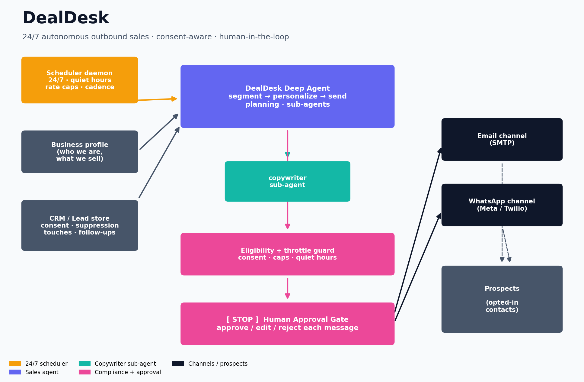

# 🚀 PostPilot — Agentic Social Media Poster

PostPilot turns a **single creative brief** into ready-to-publish posts for
**Twitter/X, Instagram, and LinkedIn** — generating a hero image, drafting
platform-native copy with specialist sub-agents, and showing you the **final
posts for approval** before anything goes live. Approve, and the agentic flow
publishes for you.

Built on **[LangChain `deepagents`](https://github.com/langchain-ai/deepagents)**
(planning + virtual filesystem + sub-agents on top of LangGraph) with a true
**human-in-the-loop approval gate** powered by LangGraph interrupts.

It ships with **two agentic modules**, both built on the same deep-agent + HITL
foundation:

| Module | What it does |
| --- | --- |
| 🚀 **PostPilot** | Brief → hero image → platform-native posts → approve → publish |
| 📣 **DealDesk** | Understands your business → finds eligible prospects → personalized email/WhatsApp outreach → approve → send, on a 24/7 cadence |


---

## ✨ What it does

```
Brief ─▶ Plan ─▶ Generate hero image ─▶ Draft per-platform copy (sub-agents)
      ─▶ ⛔ Show final posts for approval ─▶ Publish to each network
```

- **One brief in, a full campaign out.** You describe the post once.
- **Specialist sub-agents** write native copy per platform (tone, length,
  hashtag conventions) — Twitter ≤280, Instagram ≤2200, LinkedIn ≤3000 chars.
- **Hero image generation** via OpenAI or Gemini, with a zero-credential local
  placeholder fallback so the demo always runs.
- **Human-in-the-loop gate.** The agent *pauses* and surfaces the exact final
  payload (caption + image). You **approve / edit / reject** each post.
- **Agentic publishing.** Approved posts are published through the real
  platform APIs (or staged to `./outbox` in dry-run).

### The final-post approval screen

This is the only thing you have to look at — the finished posts, side by side:

| Hero image | Review & approve |
| --- | --- |
|  | Each platform card shows the image, the final caption with a live character count, and an **Approve / Edit / Reject** control. Nothing publishes until you press **Publish**. |

---

## 🏗️ Architecture

| Layer | Component | Role |
| --- | --- | --- |
| **UI** | `app.py` (Streamlit) / `cli.py` | Collect the brief, render final posts, capture approvals |
| **Orchestrator** | `src/social_poster/agent.py` | `deepagents` deep agent — plans, calls the image tool, delegates to sub-agents, requests publishing |
| **Sub-agents** | `twitter_writer`, `instagram_writer`, `linkedin_writer` | Isolated-context copywriters, one per platform |
| **Tools** | `src/social_poster/tools/` | `generate_image` + `post_to_{twitter,instagram,linkedin}` |
| **Approval gate** | `interrupt_on=` + LangGraph checkpointer | Pauses before every publish for approve/edit/reject |
| **Runner** | `src/social_poster/runner.py` | Start the flow, read pending posts, resume with decisions |

The three `post_to_*` tools are registered in `interrupt_on`, which wires
deepagents' Human-in-the-Loop middleware. Combined with a checkpointer, the
graph pauses before publishing and the UI resumes it with the human's
decisions. Regenerate the diagram any time with:

```bash
python scripts/generate_diagrams.py
```

---

## 📣 DealDesk — autonomous sales & marketing

DealDesk is the outbound module: it **understands your business**, finds the
prospects it's allowed to contact, drafts a genuinely personalized message for
each, shows them to you for approval, and sends across **email and WhatsApp** —
continuously, 24/7.



```
Business profile + CRM ─▶ Scheduler (24/7) ─▶ Sales agent: segment → personalize
   ─▶ eligibility + throttle guard ─▶ ⛔ approve / edit / reject ─▶ Email + WhatsApp
```

- **Understands your business.** Edit `data/business_profile.yaml` (see the
  `.example`); the agent grounds every message in what you actually sell.
- **CRM with consent built in.** `data/leads.json` tracks each prospect's
  contact info, **consent** (opt-in / legitimate-interest / none / unsubscribed),
  status, touches, and follow-up date.
- **Personalized, multi-channel outreach.** Email via SMTP, WhatsApp via the
  Meta Cloud API or Twilio — each message written for that specific lead.
- **Always-on.** `python marketing_cli.py daemon` runs batches on an interval
  forever, respecting quiet hours, daily caps, and follow-up cadence.
- **Compliant by default.** Only contactable leads are ever reached;
  suppression/unsubscribe is permanent; every email carries an unsubscribe
  footer + `List-Unsubscribe` header; sends are rate-limited.
- **Human-in-the-loop** by default — the daemon can run fully autonomously
  (`MARKETING_AUTONOMOUS=true`) only when you opt in.

```bash
python marketing_cli.py seed                 # load example opted-in leads
python marketing_cli.py run                  # one supervised batch (approve each)
python marketing_cli.py run --auto-approve   # one batch, auto-approved
python marketing_cli.py daemon               # 24/7 scheduler
# …or use the DealDesk page in the Streamlit app.
```

> ⚖️ **You are responsible for lawful use.** Mass unsolicited messaging can
> violate CAN-SPAM, GDPR, PECR, CASL, TCPA, and WhatsApp's Business Policy.
> Keep `MARKETING_REQUIRE_OPT_IN=true`, only load contacts you have a lawful
> basis to reach, and honor unsubscribes. The guardrails help; they are not
> legal advice.

| Component | File | Role |
| --- | --- | --- |
| Sales agent | `src/social_poster/marketing/agent.py` | DealDesk deep agent + copywriter sub-agent + send approval gate |
| Business profile | `marketing/business.py` | Loads who you are / what you sell |
| CRM | `marketing/crm.py` | Leads, consent, suppression, due/follow-up logic |
| Channels | `marketing/channels/` | Email (SMTP) + WhatsApp (Meta/Twilio), dry-run staging |
| Governor | `marketing/governor.py` | Rate limits, daily caps, quiet hours |
| Scheduler | `marketing/scheduler.py` | The 24/7 batch daemon |

---

## 🚦 Quickstart

```bash
# 1. Install
pip install -r requirements.txt

# 2. Configure (optional — it runs with zero keys in DRY RUN)
cp .env.example .env        # add ANTHROPIC_API_KEY to use the agent

# 3a. Web UI (recommended)
streamlit run app.py

# 3b. Or the CLI
python cli.py "Announce our solar-powered backpack — playful, for adventurers" \
    --platforms twitter,linkedin
```

> **Dry run by default.** `SOCIAL_POSTER_DRY_RUN=true` means no real posting:
> approved posts are written to `./outbox/*.json` and a fake permalink is
> returned, so you can exercise the entire agentic flow with **no social
> credentials**. The only key needed to run the agent itself is an
> `ANTHROPIC_API_KEY` (or swap the model via `SOCIAL_POSTER_MODEL`).

### Going live

Set `SOCIAL_POSTER_DRY_RUN=false` and fill in the platform credentials in
`.env`:

- **Twitter/X** — API key/secret + access token/secret (`tweepy`).
- **Instagram** — Graph API user id + long-lived token. *Requires a public
  `https` image URL* — upload the hero image to your CDN and pass that URL.
- **LinkedIn** — member access token + author URN (`urn:li:person:…`).

---

## ⚙️ Configuration

| Variable | Default | Purpose |
| --- | --- | --- |
| `SOCIAL_POSTER_MODEL` | `claude-sonnet-4-5-20250929` | Chat model for every agent |
| `SOCIAL_POSTER_DRY_RUN` | `true` | Simulate posting to `./outbox` |
| `SOCIAL_POSTER_IMAGE_PROVIDER` | `auto` | `auto`/`openai`/`gemini`/`placeholder` |
| `ANTHROPIC_API_KEY` | — | Default model provider key |
| `OPENAI_API_KEY` / `GOOGLE_API_KEY` | — | Image generation |
| `TWITTER_*`, `INSTAGRAM_*`, `LINKEDIN_*` | — | Live posting credentials |
| `MARKETING_DRY_RUN` | `true` | Simulate outreach to `./outbox/marketing` |
| `MARKETING_REQUIRE_OPT_IN` | `true` | Only contact leads with a lawful basis |
| `MARKETING_AUTONOMOUS` | `false` | Let the daemon auto-send without approval |
| `MARKETING_MAX_PER_DAY` / `MARKETING_MAX_PER_RUN` | `200` / `25` | Send caps |
| `MARKETING_QUIET_START` / `MARKETING_QUIET_END` | `21` / `8` | Quiet hours |
| `SMTP_*` | — | Email outreach credentials |
| `WHATSAPP_PROVIDER` + `WHATSAPP_*` / `TWILIO_*` | `meta` | WhatsApp outreach |

See [`.env.example`](.env.example) for the full list.

---

## 🧪 Tests

```bash
PYTHONPATH=src python -m pytest -q        # or: python tests/test_core.py
```

`test_core.py` covers PostPilot (tools, dry-run pipeline, interrupt parsing,
agent wiring). `test_marketing.py` covers DealDesk (business profile, CRM
consent/suppression, governor quiet-hours/caps, dry-run send + follow-up,
approval wiring). Everything runs **without needing an LLM API key**.

---

## 📁 Layout

```
.
├── app.py                       # Streamlit home (PostPilot)
├── pages/1_DealDesk_Sales.py    # Streamlit page (DealDesk outreach)
├── cli.py                       # PostPilot CLI
├── marketing_cli.py             # DealDesk CLI (leads / run / daemon)
├── scripts/generate_diagrams.py # Architecture diagrams (matplotlib)
├── data/                        # business_profile + leads (.example files)
├── docs/                        # architecture diagrams, sample hero image
├── src/social_poster/
│   ├── agent.py · runner.py · prompts.py · schemas.py · config.py
│   ├── tools/                   # image_gen + per-platform posting tools
│   └── marketing/               # DealDesk: agent, crm, channels, governor, scheduler
└── tests/                       # test_core.py + test_marketing.py
```

---

## ⚠️ Notes & responsible use

- Always review generated copy before publishing/sending — the approval gate
  exists for exactly this reason.
- Respect each platform's automation and content policies and rate limits.
- **Outbound outreach:** only contact people you have a lawful basis to reach,
  keep `MARKETING_REQUIRE_OPT_IN=true`, honor unsubscribes immediately, and
  comply with CAN-SPAM / GDPR / PECR / CASL / TCPA and WhatsApp Business policy.
  These guardrails reduce risk but are not legal advice.
- Keep credentials and real CRM data in `.env` / `data/` (git-ignored); never
  commit them.
